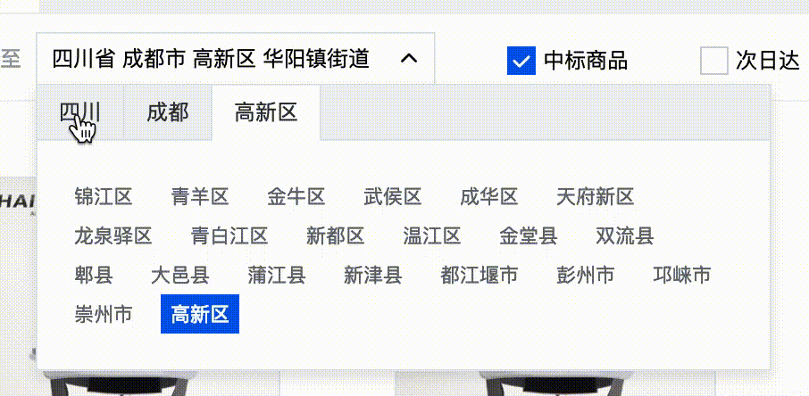

# Cascader

jQuery.Cascader multiselect component. [中文](README-zh_CN.md)



## FEATURES

* Maximize reuse of old DOM
* Support local & remote data sets
* Support load remote data by `apiMethod` configuration options
* Recursive rendering supports arbitrary depth tree-like data

## ChangeLogs

+ 2019-03-14:
  1. feat: Support `config.options.onChange(currentActiveItem: Cascader.ActiveItem, allActiveItems: allActiveItems[]<ActiveItem>, cascader: Cascader)`,
  2. feat: Support `Cascader.complete()` => `config.options.onComplete(currentActiveItem: Cascader.ActiveItem, allActiveItems: allActiveItems[]<ActiveItem>, cascader: Cascader)`
  3. feat: Support `Cascader.getLabelText(returnsArray: boolean): string` to get all `label`


# USAGE

## pug fragment

```pug
.cascader.J_Cascader
  .cascader-hd.J_CascaderHead
    .cascader-hd-val.J_CascaderVal= 'please select'
    .cascader-hd-icon
      i.icon.icon-arrow-down
  .cascader-bd.J_CascaderBody
    .cascader-panel.J_Panel
      .cascader-panel-hd.J_PanelHead
      .cascader-panel-bd.J_PanelBody
```

## HTML fragment
```html
<div class="cascader J_Cascader">
  <div class="cascader-hd J_CascaderHead">四川省成都市</div>
  <div class="cascader-bd J_CascaderBody">
    <div class="panel J_Panel">
      <div class="panel-hd J_PanelHead"></div>
      <div class="panel-bd J_PanelBody"></div>
    </div>
  </div>
</div>
```

## Configuration Options

```js
const defaults = {
  ele: '.J_Cascader', // container element，default is the ele of `$(ele).initCascader()`
  value: null, // initial value of Cascader，if passed it will call `apiMethod(value)` to get data then rendering them to inner DOM elements of container element
  head: '.J_CascaderHead', // see `DOM fragment` above
  body: '.J_CascaderBody', // see `DOM fragment` above
  input: '.J_CascaderVal', // see `DOM fragment` above
  panelHead: `.J_PanelHead`, // see `DOM fragment` above
  panelBody: `.J_PanelBody`, // see `DOM fragment` above
  panelTpl: `<div class="cascader-panel-item"></div>`, // template string of `Panel-Item`
  panelItemTpl: `<a href="javascript:void(0);" title=""></a>`, // template string of Panel-Item-Anchor
  animation: true, // open $.slide() `animation` or not
  apiMethod: null, // the method for get remote data
  onChange: noop, // onChange => (currentActiveItem)
  onComplete: noop // onComplete => (currentActiveItem: ActiveItem, allActiveItems: allActiveItems[]<ActiveItem>)
}
```

## Adapting/Formatting DATA
The data format returned by `apiMethod` needs to be converted to the following data structure by a adapter function * tree-data = `dataAdapter(response.data)` * ：

```js
[{
   label: '',
   value: '', // ID
   children: [{
       label: '',
       value: '', // ID
       children: [{
         label: '',
         value: '', // ID
         children: [{}, {}, {}]
       }] // Recursive tree-like data
   }, {}, {}] // the children of current cascading node
}]
```

Because the text and ID are rendered inside of the Cascader component by looping the `label` and `value` of the first layer of data to each DOM node, and if current item data has a certain `item.children` exists in processing, current reference of `item.children` will be recorded, after the first layer is rendered, then recursively call the `renderPanel` method inside the component to render the second layer of data, looping back and forth.

## [Example]('../../../pages/search/index.js')

### ES6
```js
import Cookies from 'js-cookie'
import Cascader from 'jquery-cascader'
import { getAreas } from '../../includes/mixins/CommonRequest'

// 1. new operator
$('.J_Cascader').each(function () {
  return new Cascader({
    ele: this,
    value: Cookies.get('area-code') || null,
    apiMethod: getAreas,
    onChange: (currentActiveItem, allItems, cascaderInstance) => console.log(currentActiveItem, allItems, cascaderInstance),
    onComplete: ({ value: id, levelCode }) => {
      id && Cookies.set('area-code', id)
    }
  })
})

// 2. jQuery plugin => $.fn.initCascader
$('.J_Cascader').initCascader({
  value: Cookies.get('area-code') || null,
  apiMethod: getAreas,
  onChange: (currentActiveItem, allItems, cascaderInstance) => console.log(currentActiveItem, allItems, cascaderInstance),
  onComplete: ({ value: id, levelCode }) => {
    id && Cookies.set('area-code', id)
  }
})
```

### ES4

```HTML
<script src="packages/lib/jquery.js"></script>
<script src="packages/lib/js-cookie.js"></script>
<script src="packages/components/commonrequest-runtime.js"></script>
<script src="packages/components/cascader-runtime.js"></script>
```

```js
$('.J_Cascader').initCascader({
  value: Cookies.get('area-code') || null,
  apiMethod: CommonRequest.getAreas,
  onChange: function (currentActiveItem, allItems, cascaderInstance) {
    console.log(cascaderInstance.getLabelText())
  },
  onComplete: function (activeItem) {
    console.log('activeItem: ', activeItem)
    const id = activeItem.value

    id && Cookies.set('area-code', id)
  }
})
```


# TODO

* animation effect when `loading`
* error handler when error


# LICENSE
MIT